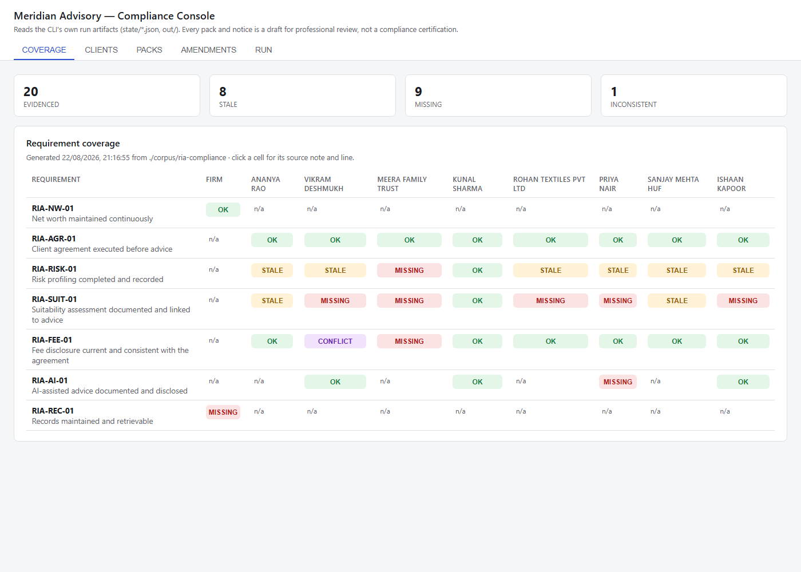

# NotesForge

A zero-dependency Node 20+/TypeScript CLI agent that turns a folder of rough notes into a finished, exported report using the [SuperDocs](https://docs.superdocs.app) REST API.

This build also carries a specialisation on top of the same engine — **[RIA Compliance Packs](#ria-compliance-packs)** — that turns SEBI compliance notes into per-client compliance packs with an honest, evidence-based coverage report. See that section for what it adds and the one rule it never breaks.

## Quickstart

```bash
npm install
npm run dev -- --notes ./sample-notes --title "Q3 Report" --out ./out
```

First run self-signs up for a free SuperDocs agent account (500 ops/month) and saves the key to `~/.superdocs/agent_credentials.json`. Every run after that reuses it.

## Flags

| Flag | Purpose |
|---|---|
| `--notes <dir>` | Notes folder to ingest (default `./sample-notes`) |
| `--title <string>` | Report title (default: chosen by the AI) |
| `--out <dir>` | Export output folder (default `./out`) |
| `--formats <csv>` | Export formats: `docx,pdf,html,markdown,txt` (default `docx,pdf`) |
| `--no-page-breaks` | Skip page breaks before each top-level section |
| `--plan-only` | Run ingestion + planning only, print the outline, spend nothing else |
| `--whoami` | Resolve credentials and print account slug/tier/ops remaining |
| `--budget` | Print the ops ledger report for this run |
| `--handoff <email>` | Email a one-time adoption link + print/save a takeover code |
| `--ops-cap <n>` | Override the hard per-run ops cap (default 25) |

## Operation economics

A full run — plan, generate, verify, finish, export — costs on the order of **2-4 ops** against the 500/month free tier, not the naive 10+ a per-section, per-format, per-check implementation would rack up. Four choices keep it there:

1. **Batched edits.** Every multi-part instruction (finishing touches, section repairs) goes in a single chat call. A four-part finishing pass is one operation, not four; the docs are explicit that a large multi-section edit still only bills once.
2. **Free structure reads.** Checking whether an edit landed uses `GET /v1/documents/{id}`'s `structure` block (headings, section/block counts) — derived on read, never billed. Verification never spends an export just to look.
3. **`response_mode: 'compact'`.** Document-scale generation and polling use compact mode, which returns per-section `chunk_diffs` instead of the full document HTML — thousands of tokens saved per turn on anything beyond a page or two, and it doesn't change what's billed.
4. **Pre-signed transfers.** Anything over 100KB moves through pre-signed upload/download URLs — bytes go straight between the note/export file and SuperDocs' storage, never through the agent's own context window.

## Design decisions

**Reuse-first signup.** `resolveCredentials()` checks `SUPERDOCS_API_KEY`, then `~/.superdocs/agent_credentials.json` (validated live via `whoami`), and only calls `POST /v1/agents/signup` if both come up empty or dead. Most agent integrations skip this and mint a new account every run; NotesForge treats a live account as something to preserve, not throw away.

**Async + polling over sync.** Document-scale generation goes through `POST /v1/chat/async` and polls `GET /v1/jobs/{job_id}`, because synchronous `/v1/chat` hits a ~300s gateway timeout on long turns. Polling also surfaces two distinct pause types: a `continue_prompt` pause (a large edit asking for a fresh budget — resumed automatically) versus a genuine human-in-the-loop approval pause (surfaced, not resolved silently).

**Named error taxonomy.** `SuperDocsClient` never throws a bare `Error` for a known failure mode — `AuthError` (401), `DocumentInUseError`/`TurnRevertedError` (409, distinguished by the response's `code`), `QuotaError` (429, no blind auto-retry), `ServerError` (5xx, retried twice with backoff), `NetworkError`. Each name is a different thing to do about it, not just a status code to log.

## RIA Compliance Packs

An extension of the same engine, specialised for a narrower and higher-stakes job. Point a folder of SEBI Registered Investment Adviser compliance notes at it and it produces a per-client compliance pack, traceable section-by-section to the specific regulatory requirement it evidences, backed by an honest coverage report. A version-and-consent trail tracks who is on which template and who has actually consented to it, so that when a requirement's text changes, the system knows exactly which clients are affected and issues a targeted amendment instead of reissuing everything.

> **This produces drafts for a compliance professional to review. It does not produce compliance, does not certify anything, and does not imply it does.** Meridian Advisory Services holds no certification this tool claims on its behalf, and none should be inferred from any document it generates.

Every generated pack and amendment notice opens with, verbatim:

> DRAFT FOR PROFESSIONAL REVIEW — this document is generated from source notes/records and does not constitute compliance advice or certification.

### Quickstart

```bash
SUPERDOCS_API_KEY=your-key-here npm run dev -- compliance --coverage
```

That one command resolves credentials (self-signs up on first run if `SUPERDOCS_API_KEY` isn't set and no saved key exists yet), reads [`corpus/ria-compliance/`](corpus/ria-compliance/), and prints an `EVIDENCED`/`STALE`/`MISSING`/`INCONSISTENT` line for every (requirement, client) pair — the same grid the [UI console](#ui-console) renders visually (screenshot below). Everything else — drafting packs, seeding the version registry, running an amendment — is one more `compliance` subcommand away; see Flags below.

### Flags

| Flag | Purpose |
|---|---|
| `compliance --list-requirements` | Print the requirements register (id, frequency, scope, citation) |
| `compliance --list-clients` | Print the client roster (AI-assisted flag, agreement version, last risk review) |
| `compliance --coverage` | Run the coverage engine and print a status line per (requirement, client) |
| `compliance --generate` | Plan outlines, assess coverage, draft, verify and export one pack per client |
| `compliance --registry-seed` | Populate the version/consent store from the templates and corpus (idempotent) |
| `compliance --matrix` | Print and persist the client × template consent matrix |
| `compliance --amend` | Run DETECT → SCOPE → AMEND → NOTIFY → RECORD against a changed requirements register |
| `--notes <dir>` | Notes folder for compliance mode (default `./corpus/ria-compliance`) |
| `--clients <csv>` | Restrict `--generate` to specific client ids, e.g. `CL-01,CL-04` (default: every client) |
| `--today <YYYY-MM-DD>` | Override "today" for staleness arithmetic — useful for reproducible runs (default: now) |
| `--out <dir>` / `--formats <csv>` | Export destination/formats for `--generate` (default `./out`, `docx,pdf`) |
| `--no-export` | Skip exporting packs to disk (drafting and verification still run) |
| `--new-requirements <path>` | Register to detect an amendment against, for `--amend` (default `./config/requirements-v2.yaml`) |
| `--effective-from <date>` | Effective date recorded on an amendment's new template version and notices (default: today) |
| `--no-regen-comparison` | Skip `--amend`'s side-by-side full-regeneration ops comparison |
| `--ops-cap <n>` | Same hard per-run cap as the base pipeline (default 25) |

### SuperDocs features used

- **`chat`** — one-shot calls: per-client pack outline planning (batched for the whole roster in one call), the single narrow suitability-staleness judgment (batched across every ambiguous client), and a single-clause amendment redraft.
- **`chat/async` + job polling** — pack drafting goes through the same async-job pattern as the base pipeline, for the same reason: a multi-section draft can run past the sync gateway's timeout. Polling distinguishes a `continue_prompt` pause (resumed automatically) from a genuine human-in-the-loop approval pause (surfaced, never silently resolved) — this pipeline hasn't hit a live approval pause of the second kind, so `approve_change` isn't exercised by compliance mode specifically; it's part of the same `SuperDocsClient` the base pipeline uses.
- **Free structure reads (`GET /v1/documents/{id}`)** — verification checks every planned section landed, and that every non-MISSING section still carries its citation, by reading `structure` (headings only), never spending an export just to look.
- **`response_mode: 'compact'`** — pack generation and its polling use compact mode: per-section `chunk_diffs` instead of full document HTML.
- **Batched multi-section edits** — one client's whole pack (up to five sections) is one `chat/async` request, billed once; one amendment's clause redraft is one `chat` request regardless of how many clients it fans out notices to afterward.
- **Pre-signed export (`request_download_url`)** — every generated pack exports to `out/<client_id>/` in docx and pdf, streamed straight from the pre-signed URL to disk; this call is a free read, so exporting costs nothing against the ops budget.
- **Agent credential reuse** — the same `resolveCredentials()` the base pipeline uses; compliance mode never signs up a second account.

Notes are inlined directly into the chat message, not uploaded as documents — the compliance corpus is nine small text files, well under the pre-signed-upload threshold the base pipeline reserves for larger inputs. `request_upload_url` is exercised by the base report pipeline, not by compliance mode.

### Why this use case

SEBI's AI-disclosure obligations for investment advisers — the per-model traceability and audit-trail language in Regulation 15(14) and 18(9), inserted by the SEBI (Investment Advisers) (Second Amendment) Regulations, 2024 — are a document set that plainly did not exist eighteen months before this was built, and it's wired in as `RIA-AI-01`. A firm using AI-assisted advice has to keep that requirement's own AI-usage documentation in sync with the advice actually being given, and with whatever the requirement says next. This build exists to answer a real question about that posture: when the compliance ground moves, does the system re-verify everything, or does it re-verify exactly what changed? [`config/requirements-v2.yaml`](config/requirements-v2.yaml) — a further tightening of `RIA-AI-01`'s obligation — exists so `compliance --amend` can answer that question against a real, executed run, not a hypothetical. See [Operation economics](#operation-economics) for what that run actually cost.

### Version and consent registry

`compliance --registry-seed` populates `state/versions.json` from the two hand-authored template versions in [`config/templates/`](config/templates/) and each client's `agreement_version`/onboarding date, recording a consent only where the corpus actually evidences a signed date — a client with no such evidence is issued but left unconsented, never guessed into consent. `compliance --matrix` renders the resulting client × template consent matrix (`CURRENT_CONSENTED` / `CURRENT_PENDING_CONSENT` / `BEHIND` / `BEHIND_NOT_CONSENTED` / `NOT_ISSUED`) and writes it to `state/consent-matrix.json`. Template versions are identified by a SHA-256 hash of their content ([`registerTemplateVersion`](src/compliance/registry.ts)), not a version label someone typed — the same content registered under two different labels is the same version. [`recordConsent`](src/compliance/registry.ts) refuses to set `consented_on` without a `consent_evidence` reference: a consent without evidence is not a consent, enforced in the one writer, not left to every caller to remember.

### Amendment flow

`compliance --amend` runs DETECT → SCOPE → AMEND → NOTIFY → RECORD against a new requirements register (`--new-requirements`, default [`config/requirements-v2.yaml`](config/requirements-v2.yaml)):

1. **DETECT** ([`detectAmendments`](src/compliance/amend.ts)) compares the new register against the last snapshot in `state/requirements-snapshot.json` (bootstrapped from `config/requirements.yaml` on first use) by content hash — a requirement is either byte-for-byte the same as what state last recorded or it isn't; no model call, no judgment.
2. **SCOPE** ([`scopeAmendment`](src/compliance/amend.ts)) finds which templates currently reference the changed requirement, and which clients currently hold the *current* version of one of those templates — the blast radius, nothing more. A client on an unrelated template, or already on a superseded version, is out of scope and untouched.
3. **AMEND** ([`amendTemplate`](src/compliance/amend.ts)) makes one `chat` call scoped to the single affected clause — the model sees only that clause's current text and the requirement's new obligation, and returns only the replacement clause. Everything else in the template carries over byte-for-byte; the new version registers under the same content-hash identity described above.
4. **NOTIFY** ([`buildAmendmentNotice`](src/compliance/amend.ts)) issues one notice per affected client: previous clause text, new clause text, the citation, and — as prominently as the change itself — a "what did not change" list, because an officer scanning this needs the scope of a change as much as its content.
5. **RECORD** writes the new template version and each affected client's new (unconsented) issuance to `state/versions.json`, and the new requirements snapshot to `state/requirements-snapshot.json`.

`--amend` also runs a real full regeneration of the same affected clients under a second ledger, purely to print genuine side-by-side ops numbers rather than an estimate — see [Operation economics](#operation-economics).

### UI console

[`ui/`](ui/) is a small React/Vite console over the CLI's own output — five tabs (Coverage, Clients, Packs, Amendments, Run) reading `state/*.json`, `config/` and `out/` as static JSON (`npm run sync` in `ui/`, wired as `predev`/`prebuild`). It recomputes nothing: the coverage grid, the consent states, the pack manifests and the ops ledger are exactly what the CLI already wrote to disk. See [`ui/README.md`](ui/README.md).

Requirements down, clients across, every planted gap visible at a glance — from a real run against the seeded corpus, not a mockup:



### Operation economics

Four different things get measured below, and each is computed a different way before any number is attached to it:

- **Coverage assessment** is almost entirely deterministic — keyword presence/absence, date arithmetic, regex-extracted figure comparison — with exactly one narrow model escalation (a suitability note that names its own profile as stale), batched so judging every ambiguous case costs one call regardless of how many there are.
- **Full pack generation** batches one outline-planning call for the whole roster, then one `chat/async` draft per client (all of that client's sections in a single turn).
- **A targeted amendment** is one `chat` call, scoped to a single clause, regardless of how many clients it fans out to afterward — the fan-out (new issuances, notices) is bookkeeping, not model calls.
- **The comparison row** is a real regeneration of the same affected clients under a second ledger, run by `--amend` itself specifically to make this an executed measurement, not an estimate.

| Operation | Method | Model calls | Ops charged | Clients affected |
|---|---|---:|---:|---:|
| Coverage assessment (`--coverage`, full roster) | deterministic pass + 1 narrow escalation | 1 | 0 | 8 (+ firm-level) |
| Full pack generation (`--generate`, full roster) | 1 batched outline + 1 `chat/async` per client | 10 | 8 | 8 |
| Targeted amendment (`--amend`, RIA-AI-01) | 1 `chat` call, one clause | 1 | 0 | 4 (blast radius) |
| Full regeneration of the same 4 clients (comparison) | 1 batched outline + 1 `chat/async` per client | 5 | 4 | 4 |

The amendment/regeneration row is the actual payoff. A real requirement change, scoped correctly, touched 4 of 8 clients — not all 8, because CL-01/03/05/07 were already on a superseded template version and out of scope — for 0 ops against 4 ops to regenerate just those four the naive way. `state/versions.json`'s diff for that run was pure addition: not one existing line for an unaffected client changed. [`src/compliance/amend.test.ts`](src/compliance/amend.test.ts) proves this byte-for-byte against a synthetic store; the numbers above are from the same shape of run against the real seeded corpus, not the test's synthetic one.

### What it does not do

- It does not verify that evidence is *correct* — only that it is *present and current*. A signed agreement on file is evidence an agreement was signed; whether its terms are lawful is a professional judgment this tool does not make.
- It does not interpret regulation. `config/requirements.yaml`'s obligation text is transcribed from the cited SEBI regulation, not paraphrased or summarised by a model at any point in the pipeline.
- It does not replace a compliance professional, and every document it produces says so.
- A missing requirement is reported as MISSING. It is never inferred, never softened by nearby text that merely *names* the gap — see `corpus/MANIFEST.md`'s RIA-REC-01 case, where a note saying "no one's formally checked" is not treated as evidence the thing was checked — and never filled in by the model.
- It does not resolve a conflict it finds. An INCONSISTENT finding (CL-02's fee figure) states what disagrees and where, and leaves the resolution to a human.
- It does not claim any certification, for the tool or for the fictional firm it was built to exercise.

### Design decisions (compliance mode)

**Deterministic where the check is arithmetic.** Coverage status is computed by keyword search, date subtraction, and regex-extracted number comparison wherever the underlying question *is* arithmetic — a model call is reserved for the one requirement (`RIA-SUIT-01`) where a genuine judgment call exists, and even then only for the specific clients whose notes name their own ambiguity.

**Template versions are identified by content, not a label.** `registerTemplateVersion` hashes a template's substantive content; two versions someone typed different labels for but which are byte-identical are the same version, and a version's identity survives even if someone edits the label later.

**Consent requires evidence, enforced in the writer.** `recordConsent` throws rather than set `consented_on` without a `consent_evidence` reference — checked once, in the one function that can set it, not left to every caller to remember.

**Amendments are scoped to a blast radius, not the whole roster.** `scopeAmendment` finds exactly which templates and which clients are actually affected by a changed requirement before anything is drafted or issued; a client on an unrelated template, or already past the version in question, is never touched, notified, or re-billed.

### All data is invented

Meridian Advisory Services, its advisers, its eight clients, every date, every fee figure and every note in [`corpus/ria-compliance/`](corpus/ria-compliance/) are fictional — see [`corpus/MANIFEST.md`](corpus/MANIFEST.md) for exactly what was planted and why. The seven SEBI requirements in [`config/requirements.yaml`](config/requirements.yaml) (and their revision in [`config/requirements-v2.yaml`](config/requirements-v2.yaml)) are real regulation, citation-checked against actual SEBI (Investment Advisers) Regulations, 2013 provisions — fabricating the regulation would make the whole exercise meaningless. Nothing here is legal advice, and no certification is claimed anywhere in the tool or this document.

### The requirements and client registers are config, not code

[`config/requirements.yaml`](config/requirements.yaml) and [`config/clients.yaml`](config/clients.yaml) are plain YAML — adding a requirement or a client is a config edit, not a code change. Since NotesForge is zero-dependency by design, [`src/domain/yaml.ts`](src/domain/yaml.ts) is a small hand-rolled parser for exactly the one shape these files use (a top-level list of flat records), not a general YAML engine — anything outside that shape is a parse error naming the file, record id and line, not a silent guess. [`src/domain/requirements.ts`](src/domain/requirements.ts) and [`src/domain/clients.ts`](src/domain/clients.ts) reject unknown fields and missing fields the same way: a typo in a config file is an error, never a silent omission.

### Parsing the model's JSON responses defensively

`planCompliancePacks` and the suitability model-escalation in `coverage.ts` both ask the model for JSON and both parse the reply through the same `parseJsonLoosely()` (in [`src/compliance/plan.ts`](src/compliance/plan.ts)), in increasing order of effort: strip any code fence, parse directly, and if the result is itself a string, parse *that* — a genuine double-encoded payload. If direct parsing throws, fall back to scanning from the first `{` for the first balanced top-level object (respecting string literals so a brace inside a quoted value doesn't end the scan early) and parse just that.

That fallback exists because of a live bug, not a hypothetical one: dumping the raw bytes of five real `planCompliancePacks` responses showed three of them were a **complete, valid** `{"outlines": [...]}` object with a stray `"}` appended immediately after the real closing brace — not a wrapped-in-a-string payload, just two leaked characters on an otherwise-good response, discarding it needlessly on roughly 60% of calls. See [`evidence/bugs/BUG-002-plan-response-trailing-garbage.md`](evidence/bugs/BUG-002-plan-response-trailing-garbage.md) for the byte-level reproduction. `src/compliance/plan.test.ts` (`npm test`, Node's built-in test runner — no new dependency) regression-tests this exact shape alongside a genuine double-encoded payload and input that should still throw.

### The corpus

[`corpus/ria-compliance/`](corpus/ria-compliance/) is nine files of invented but realistically messy compliance notes for Meridian Advisory Services — abbreviations, half-sentences, someone's shorthand — with five behaviours planted deliberately and documented file-by-file in [`corpus/MANIFEST.md`](corpus/MANIFEST.md): a firm-level requirement with no evidence anywhere, a client whose risk review is years stale, a client marked AI-assisted with no entry in the AI usage register, a fee figure that disagrees between two documents, and one client with clean, complete evidence across every applicable requirement.

### Coverage engine — deterministic first, one narrow escalation

[`src/compliance/coverage.ts`](src/compliance/coverage.ts) is the authority on `EVIDENCED | STALE | MISSING | INCONSISTENT`, and it resolves almost everything without a model call:

- **Firm-level requirements** (net worth, records) — keyword presence or absence across the whole corpus. Zero hits is zero hits; no model is needed to notice nothing is there.
- **Risk profiling staleness** — `client.risk_profile_reviewed_on` is structured config, not free text, so freshness is a date subtraction, not a judgment call.
- **Fee consistency** — the figure in the client's onboarding notes and the figure in the fee-change notes are both regex-extracted percentages; disagreement is a numeric comparison, not an opinion.
- **Agreement and AI-disclosure evidence** — presence or absence of that client's block in the relevant file.

Exactly one case escalates to the model, and only when it actually arises: a suitability note that itself says the underlying risk profile is stale or overdue. Whether that still counts as a clean pass is a genuine judgment call, so the code declines to hard-code an opinion — every such case (there are at most a handful) is batched into a single chat call, because judging three clients costs the same one operation as judging one. **A requirement with no supporting evidence is MISSING. It is never inferred, never softened, and never filled in** — this is true throughout, model call or not.

### Generation and verification

[`src/compliance/generate.ts`](src/compliance/generate.ts) turns each coverage finding into the literal section heading the model is instructed to reproduce — `{requirement title} — {Status} (source-file.md)`, with no parenthetical at all when there's no evidence, so a MISSING section can never carry a citation it didn't earn. All of a client's sections are batched into one `chat/async` request — one pack, one operation, the same batching discipline as the base pipeline's finishing pass. [`src/compliance/verify.ts`](src/compliance/verify.ts) then reuses the same free, unbilled structure read as the base pipeline to confirm every planned section landed *and* that every EVIDENCED/STALE/INCONSISTENT section still carries its citation — a live test run caught a real case of this: a heading got silently truncated past a platform length limit and lost its citation mid-generation, and verification correctly failed it. The fix was citing one representative source file instead of joining several into one long parenthetical, not loosening the check.

### Verified against the corpus

Run for real against `corpus/ria-compliance/`: `RIA-REC-01` reports MISSING firm-wide (no matching text anywhere in the corpus); the designated stale client reports STALE with the exact date (`last reviewed 2022-04-01, 1604 days ago`); the designated clean client reports EVIDENCED across all five of its applicable requirements. Three full pack generations (clean, stale, and a client with STALE/INCONSISTENT/MISSING/EVIDENCED all in one pack) drafted and verified live end to end. Total spend across all of that testing: 5 ops, against a 25-op per-run cap and a 500/month quota.

## MCP alternative

Everything above is a hand-rolled REST client, but SuperDocs also runs an MCP server at the same base URL — an agent (Claude Code, or any MCP-capable client) can skip this codebase entirely and talk to SuperDocs directly as tools:

```bash
claude mcp add -s user --transport http superdocs https://api.superdocs.app/mcp/ \
  --header "Authorization: Bearer sk_<your key>"
```

That exposes the same ~50 REST endpoints as MCP tools (chat, documents, sessions, jobs, uploads/downloads) with no client code to maintain — an agent could plan, draft, verify, and export a report purely through tool calls in a single conversation. The tradeoff is control: this repo's value is the *specific* choices above (batching, compact mode, the ops ledger, the error taxonomy) enforced in code, not left to whatever a given turn's tool-calling happens to do. For a one-off or exploratory task, MCP is less code; for a repeatable, budget-bounded pipeline, the REST client in this repo is the more predictable path.

## Architecture

```
src/
├── index.ts        CLI entry, arg parsing, run orchestration
├── compliance.ts    compliance CLI: list/coverage/generate/registry-seed/matrix/amend
├── config.ts         endpoints, limits, tunables
├── types.ts            API response/request shapes
├── logger.ts             structured run log (console + run-log.json)
├── credentials.ts          reuse-first signup
├── client.ts                 SuperDocsClient — fetch wrapper, auth, error taxonomy
├── budget.ts                   OpsLedger — tracks ops_charged, enforces a hard cap
├── notes.ts                      read + normalise the notes folder
├── pipeline.ts                     plan → create → finish (base report pipeline)
├── verify.ts                        free structure-based verification (base pipeline)
├── export.ts                          request_download_url → docx/pdf/html/md/txt
├── handoff.ts                           agent handoff + takeover code
├── domain/
│   ├── yaml.ts                            hand-rolled parser for the one YAML shape config/ uses
│   ├── requirements.ts                     load + validate config/requirements.yaml
│   └── clients.ts                            load + validate config/clients.yaml
└── compliance/
    ├── plan.ts            draft per-client pack outline (1 chat call) + defensive JSON parsing
    ├── coverage.ts          EVIDENCED/STALE/MISSING/INCONSISTENT engine
    ├── generate.ts            batched per-client pack drafting + polling + export
    ├── verify.ts                free structure + citation check
    ├── registry.ts                content-hashed template versions + evidence-gated consent
    ├── report.ts                    client × template consent matrix
    ├── amend.ts                       DETECT → SCOPE → AMEND → NOTIFY → RECORD
    └── artifacts.ts                     persists coverage/pack/ledger snapshots to state/*.json

config/
├── requirements.yaml     SEBI (Investment Advisers) Regulations, 2013 obligations — real regulation
├── requirements-v2.yaml    a further tightening of RIA-AI-01 — the amendment demo's "new" register
├── clients.yaml             invented advisory client roster
└── templates/                 the two hand-authored advisory-agreement template versions

state/                (append-only run artifacts — versions, consent, coverage, packs, ledger, amendments)
corpus/
├── MANIFEST.md         documents all five deliberately planted coverage gaps
└── ria-compliance/       Meridian Advisory Services' fictional compliance notes

ui/                  React/Vite console reading state/*.json, config/ and out/ — see ui/README.md
```

## Credit

Built for the SuperDocs task, by [kathans22](https://github.com/kathans22).
