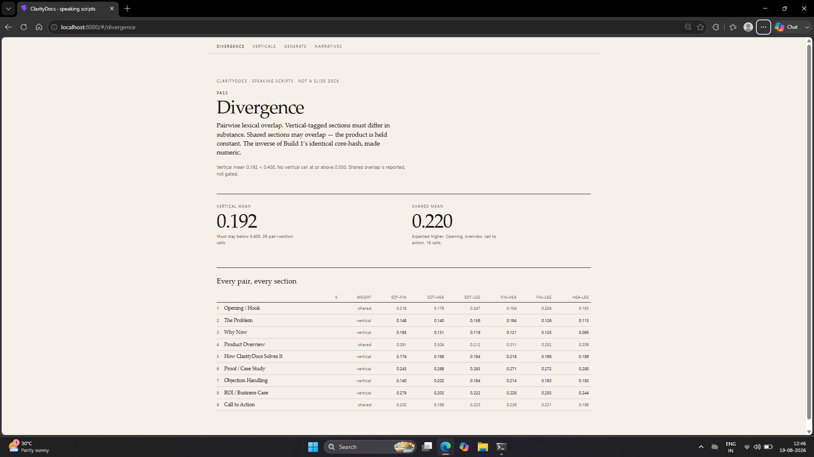
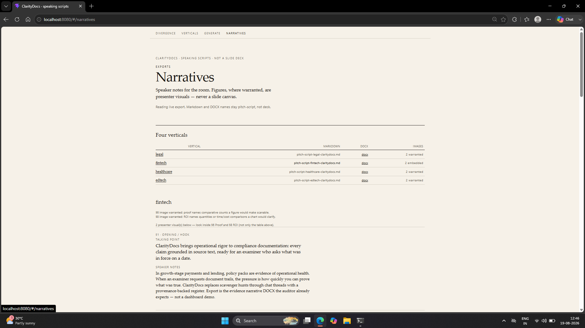

# ClarityDocs pitch-script narrative generator

**Folder:** `use-cases/kathans22/pitch-deck-narrative/` (Build 2 for the SuperDocs hiring round). Work stays inside this folder only — see the repo [CONTRIBUTING.md](../../../CONTRIBUTING.md).

A SuperDocs-backed generator that writes **vertical-specific sales speaking scripts** for one invented product — **ClarityDocs**, a document-AI assistant — across legal, fintech, healthcare, and edtech.

Each vertical gets a nine-section script: heading, talking point, full speaker notes, and an optional presenter visual. The deliverable is a **speaking script document** (markdown / DOCX). It is **not** a slide deck and is not meant to look like one.

Built **on** SuperDocs (MCP): upload → batched chat fill → approve → export. Divergence between verticals is **measured** (lexical overlap), not asserted.

## One command (API + UI)

From this folder (`use-cases/kathans22/pitch-deck-narrative`):

```text
cp .env.example .env
# Edit .env once: set SUPERDOCS_API_KEY=sk_… (never commit .env)

docker compose up --build
```

Then open:

| Surface | URL |
|---|---|
| UI (Divergence / Verticals / Generate / Narratives) | http://localhost:8080 |
| API | http://localhost:8000/verticals |

That is the documented path. No separate `npm install`, `pip install`, or Vite proxy step for the demo stack.

If startup fails, the container prints **ERROR / Cause / Fix** (missing `.env`, placeholder key, or missing `config/`). Compose also refuses to start when `.env` is absent (`env_file` required).

Stop with `Ctrl+C` or `docker compose down`.

**Clean-clone corrections applied for this prompt:** `httpx2` is listed in `pyproject.toml` (the MCP client imports it; `httpx` alone is not enough). `OPS_BUDGET_CAP` default in `.env.example` is **200** so a compose run is not blocked by the existing 39-op ledger. Demo ports are **8080** (UI) and **8000** (API), not Vite’s 5173.

## Local CLI (optional, no Docker)

```text
python -m venv .venv
# Windows: .venv\Scripts\activate
# Unix:    source .venv/bin/activate
pip install -e .

cp .env.example .env
# Set SUPERDOCS_API_KEY=sk_… in .env

python -m generator run --vertical legal
python -m generator score --from evidence/narratives
uvicorn generator.api.app:app --reload
```

Requires Python 3.12+. UI without Docker: `cd ui && npm install && npm run dev` (proxies `/api` to `:8000`).

## Run (CLI details)

```text
# Generate one vertical (idempotent for the current manifest version)
python -m generator run --vertical legal
python -m generator run --vertical fintech
python -m generator run --vertical healthcare
python -m generator run --vertical edtech

# Force regenerate (costs ops again)
python -m generator run --vertical legal --force

# Score divergence across on-disk scripts (0 SuperDocs ops)
python -m generator score --from evidence/narratives
```

Exports land under `out/` (gitignored). Reviewable copies for this build live in `evidence/narratives/`.

## Demo / screenshots

**Walkthrough video:** [https://youtu.be/2PudzAgc994](https://youtu.be/2PudzAgc994)

**Runnable demo (local):** after `docker compose up --build`, open http://localhost:8080 (UI) and http://localhost:8000/verticals (API). No separate hosted deployment URL for this build.

Screenshot placeholders for a walkthrough recording:

| Asset | Intended capture |
|---|---|
| `docs/demo/divergence-pass.png` | Divergence screen: Pass, vertical mean vs shared mean, pair×section grid |
| `docs/demo/narratives-fintech.png` | Narratives screen: fintech speaker notes + presenter visual |

Until those files exist, use the compose UI and the scripts under `evidence/narratives/`.

### Demo Screens

#### Divergence



#### Narratives — Fintech



## Credit

Built for the SuperDocs Task 2 use-case track (Build 2 — industry pitch-deck narrative generator) against [superdocsapp/superdocs-builds](https://github.com/superdocsapp/superdocs-builds).

## SuperDocs features used

| Capability | How this build uses it |
|---|---|
| Document upload | Nine-section speaking-script skeleton (HTML) uploaded into a session |
| Chat edits | Batched section fill (default **2** sections per call) from vertical YAML knowledge |
| Approve / landed-check | Proposed changes double-parsed; section bodies compared pre/post; failed sections split-retried alone |
| Export | Markdown + DOCX speaking scripts (`pitch-script-<vertical>-claritydocs.*`) |
| Image generation (chat) | Presenter visuals only where `image_eligible` **and** the content heuristic says warranted — billed as normal chat ops, not a separate SKU |
| MCP | Generator drives SuperDocs over streamable HTTP MCP with bearer auth |

Surfaces not required for the bar (multi-doc sessions, templates library UI, etc.) stay unused on purpose.

## Divergence report (measured)

Source: `evidence/divergence-report.json` (rescored after the cleaned four-vertical scripts). Method: **word Jaccard** pairwise overlap. Gates: vertical mean **&lt; 0.40**; no vertical-tagged cell **≥ 0.55**. Shared sections are reported, not gated.

| Metric | Value |
|---|---|
| Verdict | **PASS** |
| Mean vertical overlap | **0.192** |
| Mean shared overlap | **0.219** |
| Vertical pair×section cells | 36 |
| Shared pair×section cells | 18 |
| Hot vertical cells (≥ 0.55) | none |

Per-pair mean overlap (vertical-tagged sections only):

| Pair | Mean vertical | Mean shared |
|---|---|---|
| edtech ↔ fintech | 0.192 | 0.234 |
| edtech ↔ healthcare | 0.191 | 0.216 |
| edtech ↔ legal | 0.195 | 0.227 |
| fintech ↔ healthcare | 0.202 | 0.218 |
| fintech ↔ legal | 0.188 | 0.227 |
| healthcare ↔ legal | 0.185 | 0.192 |

Highest vertical cells (still under the 0.55 gate): edtech↔legal §6 **0.293**; healthcare↔legal §6 **0.280**; edtech↔fintech §8 **0.279**.

Full pair×section matrix: open the Divergence screen (`ui/`, `#/divergence`) or the JSON report.

## Ledger total

| Run | Ops charged |
|---|---|
| Four-vertical narrative generation (`evidence/ledger-four-verticals.json`) | **39** |
| Live image insert (8 warranted figures × 1 chat op) | **+8** |
| CLAUDE.md happy-path estimate (4 × 5 batches) | ~20 |

Export, download, format guard, and divergence scoring are **0** ops. Actual generation ran ~2× the happy-path floor because landed-check split-retries billed extra chat calls. Still well inside the 10,000-op budget. Source of charged ops: `evidence/ledger-four-verticals.json`.

## Two hard constraints → enforcing mechanisms

The Build 2 bar is not “looks fine on a skim.” Two claims are enforced in code so a reviewer can fail the build without arguing about taste.

| Hard constraint | Mechanism | Where |
|---|---|---|
| **Not a slide deck** — export must never be confusable with a presentation file | Structural assertion: filename/title must not carry deck/slide signatures; the speaking-script disclaimer line must be present; failed exports are deleted and raise `FormatGuardError` naming the check | `src/generator/format_guard.py`, wired into every narrative export |
| **Substance, not vocabulary** — verticals must differ in pitch content, not just industry nouns | Pairwise **word Jaccard** overlap per section across every vertical pair; vertical-tagged sections must keep mean overlap **&lt; 0.40** and no cell **≥ 0.55**; shared sections may overlap more (product is held constant) and are reported only | `src/generator/divergence.py` → `evidence/divergence-report.json`; UI Divergence screen |

Template-and-swap (“replace legal with fintech”) fails the second gate the same way identical protected cores would fail Build 1’s core-hash. A prose claim in the README is not a substitute for either mechanism.

## Fixed decisions (and why)

Logged in the working agreement; not revisited mid-build:

| Decision | Reasoning |
|---|---|
| Product is invented **ClarityDocs**, held constant | Isolates the pitch as the variable. If the product changes per vertical, divergence becomes product noise, not vertical substance. |
| Nine slide-equivalent sections with `shared` / `vertical` weights | Makes expected variance measurable. Shared = Opening, Product Overview, CTA. Vertical = Problem, Why Now, Solution Fit, Proof, Objection, ROI. |
| Verticals from YAML knowledge files, not a skeleton with blanks | Buyer, regulatory trigger, document pain, objection, proof, and terminology are named data. Adding a vertical is a new YAML — zero code. |
| Chat batch cap **2** (configurable) | Live SuperDocs behavior: oversized batches have been observed to no-op; 2-section batches land reliably. Fixed from Phase 2, not rediscovered each run. |
| Landed-check before approval + split-retry | A response that names sections but changes none is not success. Failed sections retry alone. |
| Format guard on every export | “Not a slide deck” is an assertion, not a reminder in the prompt. |
| Images only if `image_eligible` **and** warranted | Never force a figure onto every eligible section; never skip every section by policy. Demo target: ≥1 image per vertical. |
| Divergence scored to JSON | Pairwise lexical overlap is the numeric counterpart of “read two verticals side by side.” |

## Honest limitations

**Where the divergence scorer can be gamed.** Word Jaccard rewards surface token difference. A generator could pass by synonym-swapping or padding with unique boilerplate while keeping the same argument structure. It can also fail a good rewrite that reuses many product-capability phrases (ClarityDocs is held constant). Shared sections are deliberately ungated for that reason; vertical sections still need a human side-by-side read when scores sit near the threshold. The scorer is a cheap filter for template-and-swap, not a semantic entailment model.

**What a fifth vertical needs.** One new file under `config/verticals/<code>.yaml` with the same required fields (buyer role, regulatory trigger, document pain, typical objection, proof point, terminology) that is not a noun-swap of an existing pack. Then: generate (`python -m generator run --vertical <code>`), re-score (`python -m generator score --from evidence/narratives`), and expect the new pairs to stay under the vertical gates. No generator code change. Ops: plan ~8–12 charged chat ops with retries, not the happy-path five.

**What the image-eligibility heuristic gets wrong.** It keys off digits, spelled counts, comparison/time language, and process words in Proof/ROI bodies. That:

- Misses a strong qualitative Proof story that would still help a presenter (no counts → `warranted=false`).
- Can warrant a figure for thin numeric name-dropping that is not actually chartable.
- Treats leftover placeholders / generic filler as unwarranted (correct intent) but earlier exports with `PLACEHOLDER_*` lines zeroed legal images until those sections were rewritten.
- Relies on SuperDocs chat for the actual bitmap; the API has appended extra generic sections / `placeholder.com` stubs (BUG-002) that had to be stripped by hand. Signed GCS URLs expire (~24h); this repo mirrors figures under `evidence/narratives/presenter-visuals/`.

## What broke

Bug evidence written during this build (submission-form rollup). Full write-ups live under [`evidence/bugs/`](evidence/bugs/).

| Id | One line | How badly it blocked | Workaround |
|---|---|---|---|
| [BUG-001](evidence/bugs/BUG-001-placeholder-leftovers.md) | Batched section fill left `PLACEHOLDER_*` tokens / duplicate talking-point blocks after “successful” chats | Workable — first-pass quality uneven; weak landed-check falsely passed until tightened | Fail landed-check if placeholders remain; split-retry failed sections alone; keep batch cap 2 |
| [BUG-002](evidence/bugs/BUG-002-image-insert-extra-sections.md) | Image-insert chat appended extra generic `## Section N` blocks and `placeholder.com` figures alongside real images | Partial — scorer still found real §6/§8 headings, but the speaking script was dirty | Strip the extra sections and stub images from the export; mirror real figures under `evidence/narratives/presenter-visuals/` |

## License

MIT — see [`LICENSE`](LICENSE). Compatible with the parent [superdocs-builds](https://github.com/superdocsapp/superdocs-builds) MIT license ([CONTRIBUTING.md](../../../CONTRIBUTING.md)). Secrets stay out of the tree (`.env.example` uses placeholders only).
