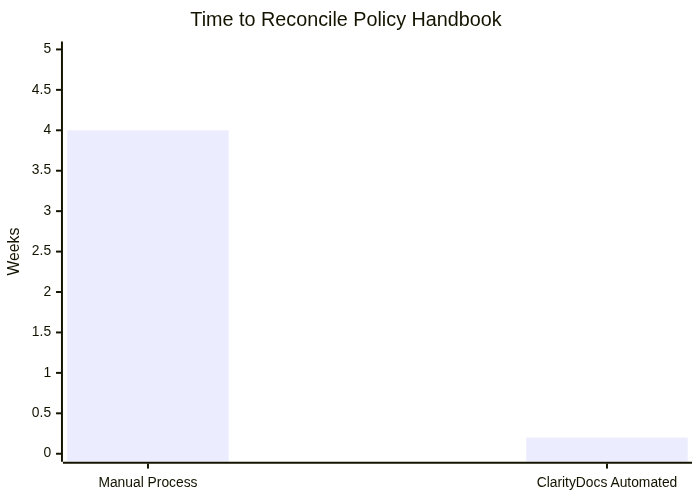

# ClarityDocs — Pitch Speaking Script

**Speaking script — not a slide deck.**

Vertical: Edtech / academic operations. Each slide-equivalent below is a speaking section with a talking point and full speaker notes — not a slide canvas.

## Slide-equivalent 1 — Opening / Hook

**Talking point:** ClarityDocs helps academic operations teams turn contradictory policy handbooks into a provenance-backed register — without asking staff to abandon the documents they already use.

**Speaker notes:** Academic operations leaders drown in document sprawl. Course catalogues, handbooks, and policy guides spread across campuses, and they rarely agree. When a policy changes in one PDF, it often stays stuck in another, creating an accreditation and state-authorization nightmare.

The usual offer is more software, a new archive, or a slide-based demo that does not help daily work. ClarityDocs does the opposite: ground every operational claim in source text, stage a human review for every change, export ordinary documents. Proof, not a demo screen.

## Slide-equivalent 2 — The Problem

**Talking point:** The policy environment is not just inefficient — students rely on documents that often contradict the policies campuses actually enforce.

**Speaker notes:** Registrars manage catalogues, handbooks, and grievance procedures that fail to stay in sync. A senate-approved update lands in a master PDF and never reaches the HTML handbook or a campus site.

Appeals committees then argue over which version was authoritative when a grade appeal was filed. You cannot feed education records or identifiable student narratives into an AI workspace for convenience. FERPA (and COPPA where under-13 products apply) is the buyer's orientation — not a claim that ClarityDocs is certified. Any rewrite of handbook language must show provenance and keep humans approving each change, with no automated decisions about student rights.

## Slide-equivalent 3 — Why Now

**Talking point:** Accreditation packs and term-effective dates have made "whichever PDF was last emailed" an indefensible source of truth.

**Speaker notes:** Four campuses publishing conflicting grade-appeal timelines is not a future risk; it is the current state. Committees cannot reconstruct which handbook governed a term. The pressure is accreditation language consistency plus FERPA constraints on who may see education records. Manual reconciliation does not scale across terms. ClarityDocs is for the registrar who must show a register, not a folder of competing PDFs.

## Slide-equivalent 4 — Product Overview

**Talking point:** ClarityDocs ingests the catalogues and handbooks you already have, stages every finding for a named human, and exports a speaking brief as ordinary DOCX — never a slide file.

**Speaker notes:** The product is held constant: extract facts with citations, run staged checks against the policy pack you name, export DOCX/PDF. In academic ops that means synthetic handbook excerpts and catalogue text — not live student records in the demo corpus. Rejected items stay rejected. The academic senate still decides; the tool does not.

## Slide-equivalent 5 — How ClarityDocs Solves It

**Talking point:** ClarityDocs builds a conflict register across campus handbooks: every flagged contradiction cites a source page, and nothing about student rights ships without a human gate.

**Speaker notes:** Course catalogues, student handbooks, and grievance procedures diverge by campus and term. ClarityDocs ingests those sources, maps conflicts, and stages each finding. Committee chairs approve or reject. A proposed "harmonised" timeline that would shorten a statutory notice window can be rejected while the rest commits. Export is a DOCX speaking brief for the next academic senate — not a slide deck, not an automated disciplinary decision.

## Slide-equivalent 6 — Proof / Case Study

**Talking point:** Invented Lumen State Academic Ops: 4 campuses published conflicting grade-appeal timelines; ClarityDocs staged a conflict register on synthetic handbook excerpts; chairs rejected 1 proposed timeline that would have shortened a statutory notice window; 3 remaining items committed with citations and exported as a DOCX senate brief.

**Speaker notes:** No real student records were in the corpus. Four campus PDFs, one conflict register, one rejected harmonisation, remaining items committed with citations. A presenter can point at those counts: four sources, one rejection, the rest kept. That is the proof pattern — comparative figures plus human authority intact.

*Presenter visual (not a slide): proof names comparative counts a figure would make scanable*
## Slide-equivalent 7 — Objection Handling

**Talking point:** We will not put student education records or identifiable student narratives into an AI workspace for convenience — and ClarityDocs is built so you do not have to.

**Speaker notes:** The objection is correct. FERPA limits who may see education records. ClarityDocs is a decision-support register for policy language, not an autonomous system that decides student rights or disciplinary outcomes. Demo work uses synthetic handbook excerpts. Every proposed edit carries a citation. Humans approve each change. We do not claim FERPA or COPPA certification.

## Slide-equivalent 8 — ROI / Business Case

**Talking point:** A registrar team reconciling a course catalogue against the student handbook across four campuses today spends weeks in email and PDF versions; ClarityDocs flags those inconsistencies before they reach students and cuts audit-prep from that scramble to a cited export.

**Speaker notes:** Primary ROI is staff time: four campuses, competing PDFs, no register. Secondary ROI is risk: accreditation packs need consistent published language. When you present to an academic senate, you export a structured, sourced policy base rather than arguing from the last attachment. Time comparison: weeks of manual reconciliation versus a staged register you can export the same day you close reviews.

*Presenter visual (not a slide): ROI names quantities or time/cost comparisons a chart would clarify*
## Slide-equivalent 9 — Call to Action

**Talking point:** Stop arguing about which handbook is current — run one conflict register on synthetic catalogue and handbook excerpts and leave with a DOCX brief, not a slide file.

**Speaker notes:** Four competing "authoritative" PDFs is an accreditation and FERPA-process risk. ClarityDocs puts the history of the policy next to the text. When a grievance committee asks why a timeline was enforced on a term effective date, the team points to the register. We are not asking you to move to a new archive. We are asking you to make the documents you already live in the source of truth they should be.
