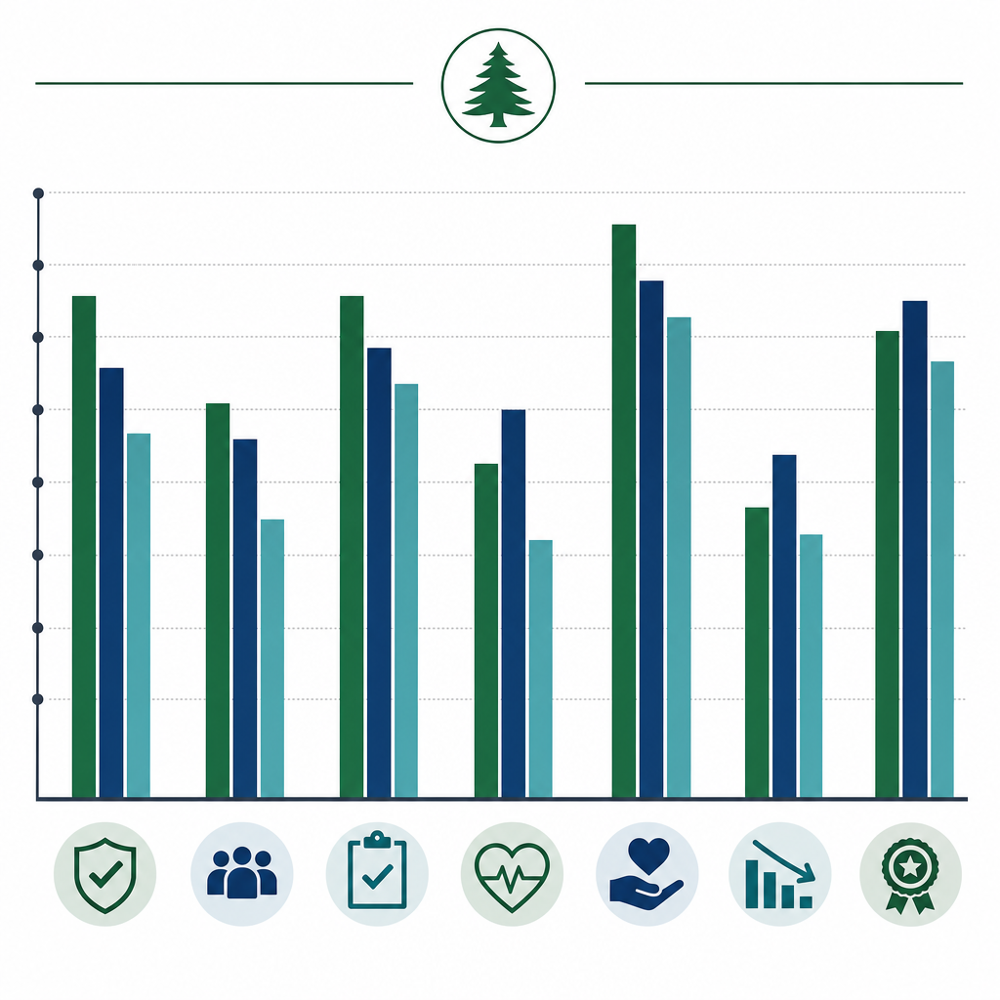
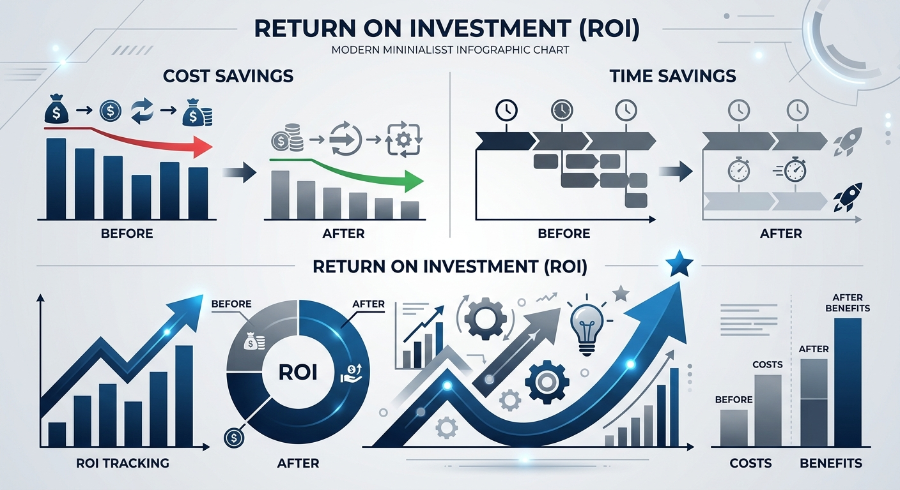

# ClarityDocs — Pitch Speaking Script

**Speaking script — not a slide deck.**

Vertical: Healthcare / clinical operations quality. Each slide-equivalent below is a speaking section with a talking point and full speaker notes — not a slide canvas.

## Slide-equivalent 1 — Opening / Hook

**Talking point:** Clinical protocols are the backbone of safety, yet multi-site groups still let discharge instructions drift across email, binders, and shared drives.

**Speaker notes:** A quality lead's job is not only to write protocols — it is to keep them followed. Across three, four, or ten hospital sites, the "standard" discharge packet mutates. ClarityDocs is the ground-truth layer: messy operational documents become reviewable, exportable work product. No clinical wording moves without a named human. Proof, not polish. We do not ask clinicians into a new archive or slide tool.

## Slide-equivalent 2 — The Problem

**Talking point:** When care pathways diverge across facilities, you face compliance pressure and no granular way to reject a bad line without redoing the whole packet.

**Speaker notes:** Quality reviews find wording that implies clinical guarantees nobody approved. The choice becomes "ship everything" or "restart everything." HIPAA Privacy and Security Rule expectations — minimum necessary, access control, documentation of how patient-related text is handled — are the buyer's orientation. This file is not legal advice and does not claim any HIPAA certification for the product. Redaction is human-reviewed, never treated as automatic.

## Slide-equivalent 3 — Why Now

**Talking point:** Site accreditation and payer documentation standards now punish "mostly consistent" discharge packets that actually live in three places with three dates.

**Speaker notes:** Orthopedics post-op instructions in a shared drive, a PDF in email, and a printed binder on the ward are three standards of care. Quality cannot guarantee the pathway. OCR and state overlays vary; treat HIPAA here as pitch context. Clinical leads need a staged register, not another all-or-nothing rewrite of the site packet.

## Slide-equivalent 4 — Product Overview

**Talking point:** ClarityDocs ingests mixed-format site packets, cites every finding to a source page, stages a named human gate, and exports ordinary DOCX — not a dashboard.

**Speaker notes:** Capabilities stay constant: extract facts with citations, staged checklist review, export DOCX/PDF. In clinical ops the corpus for demos has no patient identifiers. Nothing commits without the quality lead. We do not market guaranteed removal of personal data.

## Slide-equivalent 5 — How ClarityDocs Solves It

**Talking point:** ClarityDocs turns three drifted site packets into one staged review: reject the over-strong clinical claims, keep the rest, export the approved packet with citations.

**Speaker notes:** Care protocols and discharge instructions diverge. ClarityDocs ingests the packets, maps them to the system checklist, and lets quality reject lines item-by-item. Rejected over-claims stay out of the export. The approved packet is DOCX with citations to each source page. The human remains the gate for clinical wording and any redaction.

## Slide-equivalent 6 — Proof / Case Study

**Talking point:** Invented Cedar Ward Quality Office: 3 hospital sites had drifted post-op orthopedics discharge packets against 1 system checklist; quality rejected 2 over-strong recovery claims and kept the remaining packet lines; export was the approved packet DOCX with source-page citations and no patient identifiers in the demo corpus.

**Speaker notes:** Three sites, one checklist, two rejections, remaining instructions committed. Comparative counts a presenter can point at. No PHI in the demo. Orientation to HIPAA minimum-necessary pressure — not a certification claim.

*Presenter visual (not a slide): proof names comparative counts a figure would make scanable*
## Slide-equivalent 7 — Objection Handling

**Talking point:** Nothing that touches patient text ships without a human gate — ClarityDocs is built to support that rule, not to replace it.

**Speaker notes:** Clinical teams will not use a tool that invents clinical language or blurs PHI into training folklore. ClarityDocs extracts and cites; it does not guess guidelines. Findings that look like PHI are staged for a named human. We do not promise audited or guaranteed removal of personal data. You own the protocol and the wording.

## Slide-equivalent 8 — ROI / Business Case

**Talking point:** Cedar Ward moved from months of drifted protocol updates to a staged review that rejected two over-strong recovery claims immediately and kept the rest — weeks of manual site-by-site alignment versus one cited pass.

**Speaker notes:** Manual comparison across locations is expensive; shipping unapproved clinical claims is worse. ROI is time (weeks versus a staged pass) plus risk avoided (two claims that never shipped). The export is a consistent pathway with citations — HIPAA as orientation, not a certification of the tool.

## Slide-equivalent 9 — Call to Action

**Talking point:** Bring one synthetic site packet — no real PHI — and walk the human-gated review; leave with an exportable packet, not a slide file.

**Speaker notes:** Test against a live quality bottleneck using synthetic content. Any redaction is a named human's decision. No obligation beyond whether the register beats the binder-plus-email status quo.
