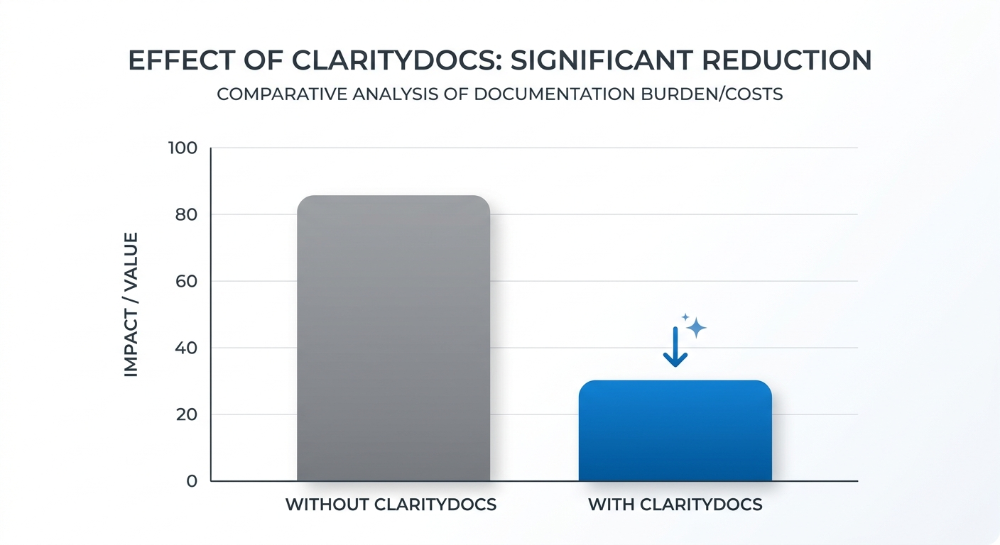
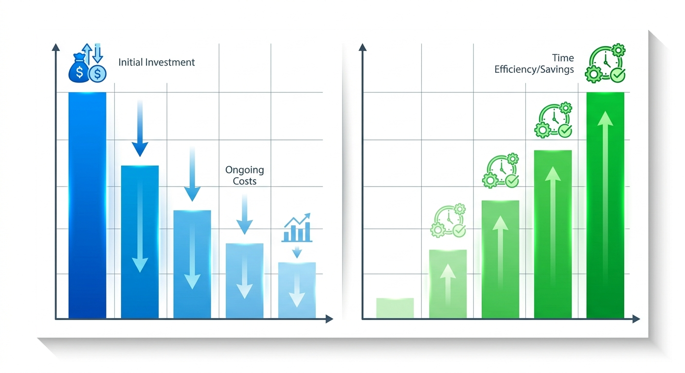

# ClarityDocs — Pitch Speaking Script

**Speaking script — not a slide deck.**

Vertical: Legal / law firm operations. Each slide-equivalent below is a speaking section with a talking point and full speaker notes — not a slide canvas.

## Slide-equivalent 1 — Opening / Hook

**Talking point:** What if you could turn the messy, fragmented work product you’re reviewing today into a permanent, defensible register of truth—without asking your associates to leave the documents they already live in?

**Speaker notes:** Every Managing Partner here knows that precedent drift is an existential risk, not just a KM nuisance. Your associates are under pressure, they’re pasting from the last matter they worked on, and the playbook language you painstakingly approved six months ago has already mutated into something else entirely.

We built ClarityDocs because you don’t need another archive or a new dashboard that buries your work product behind a demo screen. You need to ground every claim you make in the source text, stage human approval at the clause level before anything commits, and export a reviewable DOCX work product that lives in your document management system, not ours. We turn that fragmented, high-risk review process into a defensible work product—built for proof, not just polish.

## Slide-equivalent 2 — The Problem

**Talking point:** Law firm playbooks leak because associates rely on the nearest prior matter rather than the firm's approved precedent, creating continuous clause drift and confidentiality risk.

**Speaker notes:** Managing partners and KM heads know the real risk isn't just inefficient drafting—it's matter-bound drift when associates grab language from the last deal that closed, which may have been specific to that client's outside counsel guidelines or even carry risk of ethical wall violations. Copy-pasting from the closest prior bypasses quality controls, leaving partners to re-review the same problematic clauses with no register of what was previously rejected.

Your playbooks are the firm's moat. You will not throw that intelligence into a shared AI workspace where a matter-bound clause from one client could leak into another. ClarityDocs lets you run staged checks against playbook clauses, surfacing issues for item-by-item human approval before anything commits. You are not giving away the moat; you are automating the provenance of every line.

## Slide-equivalent 3 — Why Now

**Talking point:** Precedent drift is no longer a KM inconvenience — it is an unrecorded liability when outside-counsel guidelines demand traceable edits and associates still paste from the last known good.

**Speaker notes:** Partners and senior associates are drowning in manual oversight. When outside counsel guidelines demand specific language, yet associates copy-paste from the last known good document, you are not only inefficient — you are creating professional-liability exposure. The "why now" is not AI fashion. It is the erosion of the firm's precedent moat.

When a force-majeure clause drifts across three different client forms, you lose the ability to defend the firm's preferred language, and you lose the ability to prove why a deviation occurred. Matter playbooks become a liability trap rather than a strategic asset. Manual clause banks sit unused; partners rely on memory. ClarityDocs is for the moment firms must move from passive storage of precedents to traceable verification of every clause in every matter. ABA Model Rule 1.6 and related screening duties are the buyer's orientation here — not a claim that ClarityDocs is certified to any bar rule.

## Slide-equivalent 4 — Product Overview

**Talking point:** ClarityDocs is a verification engine for live work product: it grounds every finding in source text, respects the matter wall, and exports ordinary DOCX — not a dashboard.

**Speaker notes:** ClarityDocs does not write clauses for you. It ingests mixed-format source — client papers and internal playbooks — and maps every claim back to an exact place in the source. It respects the matter wall: there is no centralized cross-client brain that trains on one engagement and leaks into another.

When an associate works a draft, ClarityDocs runs staged checks against approved playbook language. It does not auto-commit. Findings are flagged for item-by-item approval. You see what changed, why, and you accept or reject in context. When the review is done, you export a standard DOCX — the work product your team already knows — not a proprietary screen. Rejected findings stay rejected without discarding the rest of the review. Built for proof, not polish.

## Slide-equivalent 5 — How ClarityDocs Solves It

**Talking point:** ClarityDocs turns clause-library drift into a cited register: ingest the priors, stage every finding against the playbook, keep humans approving each line, export the brief the engagement team already lives in.

**Speaker notes:** The pain is specific. Clause libraries and matter playbooks drift. Associates paste from the nearest prior without provenance. Partners re-review the same clause family with no register of what changed, what was rejected, or which client form was authoritative.

ClarityDocs ingests those mixed-format priors and ties every talking point to the source page. It runs staged checks against the playbook you named. Nothing commits without a named human. If a partner rejects a proposed harmonisation, that rejection stays on the register. The export is a DOCX brief for the engagement team — not a demo from a closed archive. Ethical walls stay a human and process duty; the tool does not invent a certified wall.

## Slide-equivalent 6 — Proof / Case Study

**Talking point:** At the invented Northbridge LLP Knowledge Desk, one energy matter had a force-majeure clause drift across three client forms; KM used ClarityDocs to stage a clause-drift register, partners rejected two proposed harmonisations item-by-item, and the rest committed with citations to the source prior.

**Speaker notes:** This is an invented reference story, not a named client claim. After the clause drifted across three forms, the Knowledge Desk stopped treating "the nearest prior" as authority. ClarityDocs ingested the three forms and the playbook clause family. Twelve findings were staged against the approved language. Partners rejected two proposed harmonisations that would have weakened the firm's preferred wording; the remaining ten committed, each talking point cited to the source prior.

The export was a DOCX brief the engagement team already lived in — not a dashboard. That is the proof pattern: comparative counts a presenter can point at, item-by-item human control, ordinary document out.

*Presenter visual (not a slide): proof names comparative counts a figure would make scanable*
## Slide-equivalent 7 — Objection Handling

**Talking point:** We know your precedent library is the firm's competitive moat, and putting matter-bound language into a shared AI workspace is a risk you are right to refuse.

**Speaker notes:** ClarityDocs does not create a central brain that trains across matters. Work stays inside the engagement you are reviewing. Every finding is grounded in your source documents — it does not invent clause text you did not approve.

Staged checks run against the playbook you set. Partners approve or reject item-by-item. Rejected language stays rejected. The exported DOCX is your work product with a register of what was accepted, what was rejected, and what changed. The moat stays yours.

## Slide-equivalent 8 — ROI / Business Case

**Talking point:** Northbridge replaced weeks of partner re-review on the same clause family with a register that closed in hours: twelve findings staged, two rejected, ten committed, exported as the DOCX brief the team already used.

**Speaker notes:** The hidden cost is partner time. The same clause family gets re-reviewed three times because there is no register of prior rejections. On the Northbridge energy matter, that cycle stopped: twelve findings in one pass, two rejected, ten committed, hours rather than weeks.

You are not buying a new workspace. You are buying fewer wasted partner hours and a provenance-backed brief. The ROI is the comparison: weeks of churn versus hours with a cited register, plus an export that does not force a dashboard migration.

## Slide-equivalent 9 — Call to Action

**Talking point:** If you are ready to stop unrecorded precedent drift, pick one high-friction engagement form and run a sample review — the deliverable is a DOCX register, not a slide file.

**Speaker notes:** Bring one client form where clause drift is a known headache. We will show the clause-drift register in practice and how the grounded work exports back into the DOCX files practitioners already rely on. Fifteen minutes on a real form is the test: can partners see citations, reject two lines, keep the rest, and leave with a brief they already know how to file.
