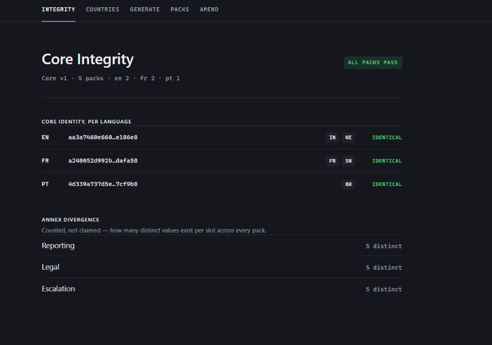

# Policy Pack Localizer

Built for the SuperDocs Round 2 hiring task.

One master safeguarding policy in, five country-specific packs out — each in the
office's working language, each carrying the identical, hash-locked protected core,
each with genuinely distinct local annexes. When the core is amended, every office
gets a short change notice naming exactly what moved, not a reissued document.

## What it does, in plain language

A safeguarding lead at an NGO ("Meridian Relief Trust", invented for this build) writes
one policy. Sections 1–5 are the non-negotiable core — the text legal has signed off.
Sections 6–9 are annex slots — reporting channels, applicable law, escalation path,
acknowledgement — and are genuinely different per country, because the underlying legal
reality is different in Mumbai, Nairobi, Lyon, Dakar, and Recife.

This tool:

1. **Locks the core.** Hashes each core section and their concatenation, per language.
   Zero SuperDocs operations — arithmetic, not intelligence.
2. **Generates a pack per country** — the locked core, verbatim, plus that country's
   own annex content, in that country's working language.
3. **Verifies every export**, not just its own claim. Re-extracts the core from the
   exported document, re-hashes it, compares against the lock. A mismatch quarantines
   the pack — it is not shipped, and the run does not report success.
4. **Produces an acknowledgement form** per office — built deterministically from known
   fields, no model call.
5. **Handles a core amendment as an update, not a reissue.** When a core section
   changes, only that section is re-translated (once per affected language, not once
   per country), and every office gets a short change notice — what changed, what
   didn't, what to do. No pack is regenerated.

The claim this build makes provable, not just assertable: **France and Senegal — two
countries, two entirely different annexes — carry byte-identical core text.** That is
the demonstration this whole design exists to produce. See
[`evidence/integrity-report.json`](evidence/integrity-report.json) for the real,
live-verified hashes.

## How to run it

Requires Docker (with Compose) and a SuperDocs API key.

### The one command

```bash
cd use-cases/kathans22/policy-pack-localizer
cp .env.example .env   # then edit .env: set SUPERDOCS_API_KEY to your real key
docker compose up --build
```

That's it — the API comes up on `http://localhost:8000` and the UI on
`http://localhost:5173`, with the UI already talking to the API (its dev-server proxy
targets the `api` container by service name, not `localhost`, inside the Compose
network). Fresh clone to a working UI takes a few minutes, mostly Docker build time on
the first run; a second `docker compose up` with no code changes comes up in seconds.

If `.env` is missing or `SUPERDOCS_API_KEY` is still the placeholder value, the `api`
container **fails immediately** with a message naming the exact variable and the exact
fix — not a stack trace, and not a container that reports healthy while silently unable
to do anything: `docker compose up` used to leave that failure hidden until you clicked
through the UI to a rollout and it produced an unclear error later. See
`docker-entrypoint.sh`.

No manual `mkdir` needed: `out/` and `state/` (bind-mounted into the API container so
generated packs and locks land on your host, in the same places the CLI writes them)
are created automatically on first write, by the app and by Docker itself for the
bind mounts — a fresh clone has neither directory, and nothing errors on that.

### Running it without Docker (local dev)

Requires Python 3.12+ and Node 18+ directly on your machine instead.

```bash
cd use-cases/kathans22/policy-pack-localizer
python -m venv .venv && source .venv/bin/activate   # or .venv\Scripts\activate on Windows
pip install -e ".[dev]"
cp .env.example .env   # fill in SUPERDOCS_API_KEY
```

Run the full pipeline for one or more countries from the command line, with no API or
UI involved at all:

```bash
python -m localizer run --countries IN,KE,FR,SN,BR
```

This locks the core (once), derives each language's core translation (once, cached),
and generates a pack per country, printing per-country OK/SKIPPED and the operations
ledger. Re-running it is free — already-produced packs are not re-bought.

Run the tests (no live API key needed — they run against recorded fixtures and fakes):

```bash
pytest
```

Serve the API (used by the React UI, and drives rollouts/amendments as background jobs):

```bash
uvicorn localizer.api.app:app --reload --port 8000
```

In a second terminal:

```bash
cd ui
npm install
npm run dev
```

Opens on `http://localhost:5173`, proxying `/api` to the backend on `:8000` (dev only —
see Limitations). Five screens: Countries, Generate, Packs, Integrity, Amend.

### Demo

- Video: [SuperDocs Policy Pack Localizer demo](https://youtu.be/D2qND-vi6G8)

- Screenshot — Integrity screen (hero shot):



## SuperDocs features used

All four calls of the minimum contract, over MCP (`api.superdocs.app/mcp`, streamable HTTP,
Bearer auth) — never REST, and never a reimplementation of SuperDocs' own editing:

- **`upload_document_base64`** — loads `config/policy-master.md` (and, for a non-English
  pack, that language's locked core assembled with the country's own annexes) into a
  session. Loading a document is free.
- **`chat`** — the only billed step. Two distinct uses, deliberately kept separate:
  - *Annex localisation*: edit instructions name only annex sections (6–9), sent in
    `annex_batch_size`-sized batches per `config/manifest.yaml`. Core sections are never
    named in any instruction sent to SuperDocs.
  - *Core translation*: the one legitimate place in the codebase that names core sections
    — structurally isolated in `translate.py`, which never imports `packs.py`, so
    `packs.assert_no_core_sections_named` can never see it.
  - Also used, as a documented fallback (`chat(document_html=...)`), to load a verbatim
    corrected document back in when a natural-language edit repeatedly failed to land on
    a specific chunk — a document load, not an AI edit, so it is free.
- **`export_document`** — every pack, acknowledgement form, and change notice is exported
  to Markdown and DOCX. Exports never cost operations, so verification (re-extract,
  re-hash, compare) always runs against the real exported artifact, never the chat
  response's own claim.
- **Double-parse handling** — `mcp_client.parse_proposed_changes()` handles both the
  already-an-object shape (`document_changes.pending_changes` on a sync `chat` call) and
  the double-encoded shape (`intermediate_responses[].content` as a JSON string, on the
  `chat_async`/job path), so nothing downstream re-implements that parse.
- **Operations ledger** (`ledger.py`) — every call is charged from the response's real
  `usage.was_billable` / `usage.ops_charged` fields, never an assumed constant. A preview
  call is free; only an applied edit is billed — discovered live, not documented.

**Not used:** `chat_async` + `approve_change` for the pack/notice path. Live testing
(Prompt 10) found `approve_change` only works against a `chat_async` job, not a
synchronous `chat` preview — the docs describe it as the HITL partner for both without
flagging that only the async path has something to approve against. This build uses
synchronous `chat` with `approve_all` throughout instead, and enforces correctness by
re-verifying the export afterward rather than trusting an approval step that doesn't
actually gate anything on this path. Full detail:
[`PROGRESS.md`](PROGRESS.md#phase-2), [`evidence/superdocs-batch-limit-report.md`](evidence/superdocs-batch-limit-report.md).

## The per-language core derivation

"Identical across all packs" and "in the working language" are in tension: a translated
core cannot be byte-identical to the English source. The resolution is that core identity
is **per-language**, not per-document — each language's core is derived exactly once and
hash-locked, and every pack in that language carries that identical locked text.

```
                    English core (source, authoritative)
                                    │
                 ┌──────────────────┼──────────────────┐
                 ▼                  ▼                  ▼
             EN core             FR core             PT core
          hash aa3a7460…       hash a240052d…      hash 4d339a73…
            (locked)              (locked)             (locked)
                 │                  │                     │
         ┌───────┴───────┐  ┌───────┴───────┐             │
         ▼               ▼  ▼               ▼             ▼
      India (IN)     Kenya (KE)      France (FR)   Senegal (SN)   Brazil (BR)
      hash aa3a…      hash aa3a…     hash a240…     hash a240…    hash 4d33…
```

**France and Senegal — two countries, two entirely different annexes — share one core
hash.** That equality is not asserted; it is read directly off five independently
generated, live-exported packs (`evidence/integrity-report.json`):

| Language | Packs | Core hash | Identical? |
|---|---|---|---|
| en | IN, KE | `aa3a7460e6602b04e59acbe8ef73be464c3951624b50903a61b548ce64e186e8` | ✅ |
| fr | FR, SN | `a240052d992b3f53af2332edd0ffe62172b87e6a963c3c8dd4dfef4d47dafa58` | ✅ |
| pt | BR | `4d339a737d5ea69c3bfd38ee983f779243c219ba869e1e9df443bb98ef7cf9b8` | ✅ (n=1) |

Annex divergence, counted the same way: `reporting` 5/5 distinct, `legal` 5/5 distinct,
`escalation` 5/5 distinct — five countries producing five genuinely different annexes,
not a name swapped into a shared paragraph.

## The two ledgers — Run 1 (rollout) and Run 2 (amendment)

Both tables below are the real, live-measured totals, not the idealised model. The
idealised model (CLAUDE.md's worked example) prices a full 5-country rollout and a
core amendment reaching all 5 offices at the same 7 operations each — the equivalence
the build exists to demonstrate: **an update should cost like an update, not like a
reissue.** The real runs cost more than 7 in both directions, for the same root cause
in both directions: live SuperDocs `chat` edit calls do not reliably apply on the first
attempt, and a failed attempt can still be billed. Every extra operation below is a
retry recovering from that, not wasted or duplicate work — see
[`evidence/ledger-summary.md`](evidence/ledger-summary.md) and
[`evidence/run2-ledger.md`](evidence/run2-ledger.md) for the full detail.

### Run 1 — initial rollout (idealised model, corrected economics per CLAUDE.md)

The build's original design doc priced a pack at 1 operation (one batched call for all
4 annex sections). Live testing (`evidence/superdocs-batch-limit-report.md`) proved that
call is not reliable — a 4-section batch can report full success while changing nothing
— so the design was corrected to 2 batches of 2 sections, and the idealised per-pack
cost is **2 operations**, not 1:

```
[lock]      core v1 locked, 5 sections, hash aa3a7460          0 ops
[translate] fr ← en                                            1 op
[translate] pt ← en                                            1 op
[pack]      IN  en  annexes 6-9, 2 batches of 2                2 ops
[pack]      KE  en  annexes 6-9, 2 batches of 2                2 ops
[pack]      FR  fr  annexes 6-9, 2 batches of 2                2 ops
[pack]      SN  fr  annexes 6-9, 2 batches of 2                2 ops
[pack]      BR  pt  annexes 6-9, 2 batches of 2                2 ops
[ack]       5 acknowledgement forms                            0 ops
[verify]    core identity ......................... PASS
                                                        ───────
                                               total    12 ops
```

**Real Run 1 cost more, and was not cleanly isolated to a single figure** — see
`evidence/ledger-summary.md`. What was captured at full precision was the final
remediation round (fixing leftover placeholder text and wrong-chunk edits across
IN/KE/FR/SN/BR after the first annex pass):

| step | ops |
|---|---|
| pack-fr — fix §6/§8/§9 leftover placeholder text | 1 |
| pack-sn — fix §6/§7/§8 leftover placeholder text | 1 |
| pack-br — fix §6 body + §9 (partial: 2 of 5 landed) | 1 |
| pack-ke — dedupe §7, attempt 1 (did not land) | 1 |
| pack-ke — dedupe §7, attempt 2 (landed, concurrent-merge notice) | 1 |
| pack-br — heading-text fix via chat, natural language | 0 (not billable) |
| pack-br — heading + §8 fix via chat, chunk-id reference | 0 (not billable) |
| pack-br / pack-ke / svc-in-1 — verbatim `document_html` reload (final fix) | 0 (a document load, not an edit) |
| **remediation round total** | **5** |

The account's promo counter is the honest anchor for the true full Run 1 total: it
dropped from 10,000 to 9,964 across the working session that produced all five clean
packs — a 36-op spend, not all of which is cleanly attributable to this run alone (the
account also carries earlier, unrelated experiment sessions). The 5-op remediation
round above is what is stated with full confidence.

### Run 2 — core amendment, v1 → v2 (section 4 only)

Idealised model:

```
[diff]        core v1 → v2: section 4 changed, 1 of 5           0 ops
[translate]   section 4 → fr                                    1 op
[translate]   section 4 → pt                                    1 op
[notice]      IN  en  1 section, 3 unchanged                    1 op
[notice]      KE  en                                            1 op
[notice]      FR  fr                                            1 op
[notice]      SN  fr                                            1 op
[notice]      BR  pt                                            1 op
                                                        ───────
                                                total     7 ops
```

Real ledger, live, `evidence/run2-ledger.md`:

```
[diff]        core v1 → v2: section 4 changed, 1 of 5           0 ops
[retranslate] fr (section 4 only)                                1 op
[retranslate] pt (section 4 only)                                1 op
[notice]      IN  en  attempt 1 — billed, changes: null           1 op
[notice]      IN  en  attempt 2 — landed                          1 op
[notice]      SN  fr  attempt 1 — landed                          1 op
[notice]      KE  en  attempt 1 — billed, changes: null           1 op
[notice]      KE  en  attempt 2 — landed                          1 op
[notice]      FR  fr  attempt 1 — landed                          1 op
[notice]      BR  pt  attempt 1 — landed                          1 op
                                                        ───────
                                                total     9 ops
```

**9 operations, not 7.** Two of the five notices (IN, KE) needed a retry: attempt 1
came back billed (`usage.was_billable: true, ops_charged: 1`) with a confused
non-edit response and `changes: null`. `send_change_notice` never trusts the response
text — it exports and checks the placeholder is actually gone before declaring
success, and both retried cleanly on attempt 2. **Zero packs were reissued** — every
notice was generated against the existing v1 packs on disk, re-verified afterward
against the v1 lock, not the new v2 lock, because no pack changed.

### The comparison that matters

| | Run 1 — full rollout | Run 2 — core amendment |
|---|---|---|
| Scope | 5 countries, 3 languages, 5 packs produced | Same 5 countries, 3 languages, **0 packs reissued** |
| Idealised operations | 2 translations + 5 packs × 2 = **12** | 2 re-translations + 5 notices × 1 = **7** |
| Real operations | 36-op session total; 5 ops isolated at full precision (remediation round) | **9**, fully and cleanly isolated |
| What ships | 5 full policy packs | 5 short (2–3 page) change notices |

**A logged tension, not silently resolved:** an earlier version of this design priced a
pack at 1 batched operation, making Run 1 and Run 2 both 7 ops — a clean symmetry. Live
testing proved that 1-call batch unreliable and forced the correction above to 2 batches
per pack, which breaks that symmetry (12 vs. 7). What the correction does *not* change is
the actual point being demonstrated: a **notice** is a single-document call, not a
multi-section annex batch, so its own idealised cost stayed at 1 operation regardless —
the amendment path was never going to inherit the pack-batching cost, because it never
batches. The real, honestly-itemised comparison is 12 real-adjacent ops to stand up the
whole rollout once, versus **9 real ops to propagate one core change to all five offices
with zero reissues** — an update that costs a fraction of standing the system up, which
is the claim this build exists to prove.

## What strong looks like, mapped to mechanism

The task brief states the bar verbatim: "Protected core text is identical across all
packs, annexes are genuinely country-specific, and a core amendment produces a
per-country change notice rather than a full reissue." Each row below is a claim, the
mechanism that makes it true, and where to find the proof rather than the assertion.

| The bar | The mechanism | The proof |
|---|---|---|
| Protected core identical across all packs | Core sections are never named in any edit instruction (`assert_no_core_sections_named` is a hard stop before any call is sent); after every export, the core is re-extracted, re-hashed, and compared against the per-language lock — never trusted from the response | `evidence/integrity-report.json`: FR and SN both `a240052d99…`; IN and KE both `aa3a7460e6…`; `all_packs_pass: true` |
| Annexes genuinely country-specific | Every country's reporting channel, applicable law, and escalation tier is real, distinct data in its own YAML file — not a template with a swapped name — and divergence is counted by content hash after export, not claimed from a country label | `evidence/integrity-report.json`: `annex_divergence` — `reporting: 5 distinct`, `legal: 5 distinct`, `escalation: 5 distinct` |
| Core amendment → per-country change notice, not a full reissue | Section-level diff (`amend.diff_core_versions`) isolates exactly which sections changed; only affected sections are re-translated, once per language; a short notice is generated per country; `service.verify_after_amendment` re-checks all five existing packs against the version they actually carry — no `generate_pack` call fires anywhere in the amendment path | `evidence/run2-ledger.md`: 9 ops, 5 notices generated, **zero packs reissued**; `service.verify_after_amendment` confirms all five packs still pass against v1 |

## Decisions logged

Seven fixed decisions, each made deliberately and each with its reasoning — logged here
rather than left implicit, because a logged assumption counts in the build's favor.

1. **Core identity is per-language, not per-document.** A translated core cannot be
   byte-identical to its English source. Each language's core is derived exactly once
   and hash-locked; every pack in that language carries the identical locked text. Two
   French-speaking countries (France, Senegal) are in the demo set specifically to make
   the equality visible across genuinely different annexes — a single-language demo set
   could only prove this within one language, a much weaker claim.
2. **The English core is authoritative.** Every pack states that its translation is
   provided for working use, not certified legal equivalence. Claiming equivalence for a
   machine translation is a claim nobody involved in this build is qualified to certify.
3. **Protection is by verification, not by instruction.** Edit instructions name only
   annex sections — core sections are never named in any instruction sent to SuperDocs.
   But the guarantee that actually holds is the hash check after every export.
   Instruction expresses intent; hashing enforces it. This distinction mattered in
   practice: live testing repeatedly showed SuperDocs report success on a call that
   changed nothing or changed the wrong chunk — trusting the instruction alone would
   have shipped broken packs with a confident success message.
4. **No sentinel markers in the document text.** The core/annex split lives entirely in
   `config/manifest.yaml`. Markers in the shipped text would leak into every pack an
   office actually reads, and would rely on the model respecting them rather than on a
   mechanism outside the model's control.
5. **Adding a country is a YAML file, not a code change.** `config/countries/*.yaml`
   carries every country-specific fact — reporting contacts, legal citations, escalation
   tiers, language. A sixth country costs one file. A sixth language costs one
   translation operation and zero code.
6. **The acknowledgement form is built deterministically, with zero SuperDocs
   operations spent on it.** Filling known fields (office, country, pack version, the
   locked core hash, safeguarding lead) into a known template has no ambiguity for a
   model to resolve — spending an operation on it would be paying to do arithmetic
   badly. SuperDocs is still used for upload and export, since both are free and produce
   the actual styled `.docx` an office signs.
7. **All organisations, offices, people, and contacts are invented** (Meridian Relief
   Trust and its five field offices). The statutes and helplines cited in each country's
   `legal`/`reporting` annex are real law and real public services — fabricating
   legislation would have made the annex-divergence proof meaningless, since "genuinely
   country-specific" has to mean specific to a real legal reality, not just distinct
   fiction.

## Limitations, honestly

A flagged gap is worth more than a silent one here.

**Where this build is thin:**

- **The Integrity screen (UI) reads a static snapshot**
  (`ui/public/integrity-report.json`), not a live `GET /api/integrity` call. Every other
  screen (Countries, Generate, Packs, Amend) is live against the real API. This is a
  known, not-yet-closed gap from when the Integrity screen was first built.
- **No run-cancellation.** The API has no "stop this run" endpoint, and the UI has no
  cancel button — a started rollout or amendment runs to completion or failure
  server-side. What exists is idempotent *resume* (kill the whole process, restart with
  the same countries, nothing is double-charged or double-generated — proven by the
  CLI's clean-then-rerun test), not in-flight *interrupt*.
- **No auth on the API.** Anyone who can reach port 8000 can trigger a rollout or
  amendment, which spends real SuperDocs operations. Fine for a local demo against a
  personal key; not something to expose past localhost as built.
- **No client-side tests.** All five UI screens were verified manually, live, against
  the real API and real `out/`/`state/` artifacts. The Python side (51 tests across
  `tests/`) has no equivalent on the React side.
- **The dev proxy is dev-only.** `vite.config.ts`'s `/api` proxy exists only under
  `npm run dev`; a production build has no backend reachable at `/api` unless something
  else fronts both origins. Not built — out of scope for a local demo.

**What the normaliser gives up.** `corelock.normalise()` canonicalises Unicode form,
line endings, quote style, dash-glyph family, space-character family, list-marker
glyphs, and blank-line runs — but leaves case and actual wording, numbers, and word
order untouched. This means a cosmetic round trip through SuperDocs' HTML export never
registers as a false core change, which is the point — but it also means the hash check
cannot distinguish "the model reformatted this sentence" from "nothing changed" if a
reformatting happens to preserve every word and word order exactly. That case was never
observed live in this build, but the normaliser's contract does not rule it out.

**Translation quality cannot be independently verified by this system.** The core hash
proves a translated core is *identical across every pack in that language* — it proves
nothing about whether the translation is *correct*. On inspection, the French and
Portuguese core translations read as accurate, idiomatic legal language, but "read as
accurate" is a human judgment made once during this build, not an automated check. A
related, observed-live limitation: independent translation calls for the same English
clause can drift in wording even when the underlying English is unchanged — Brazil's v1
core lock and v2 core lock render one unchanged clause as "idade de consentimento
local" and "idade legal de consentimento local" respectively, a cosmetic difference from
two separate live translation calls, not a substantive one. A change notice's
plain-language summary is grounded in the literal displayed text, so a purely cosmetic
re-translation difference could read to an office as if a rule changed when only its
wording did. Not fixed in this build — would need clause-level diffing or an explicit
instruction to the summary step to ignore wording-only deltas.

**What would break at fifty countries.** The design's core claims should hold —
core-per-language hashing and per-country YAML are both linear in the number of
countries and languages, not quadratic, and nothing in the mechanism assumes five. What
would not hold as-built:
- **Manual remediation does not scale.** This build's real operation counts include
  hand-observed defects (wrong-chunk edits, partial batches, a reverted concurrent
  merge) that were caught and retried, in several cases requiring a fallback to a
  verbatim `document_html` reload rather than a natural-language edit. The automated
  retry/split logic (`_apply_annex_batch`) handles the *detected* failure modes; it does
  not guarantee every future failure mode SuperDocs can produce is one of those.
  At fifty countries, a defect class this build's retry logic doesn't yet cover would
  need to be found and handled, not assumed away by volume.
- **Sequential per-country processing.** `service.run` generates packs one country at a
  time. Nothing in the design prevents parallelising across countries (each pack is an
  independent SuperDocs session), but it is not built that way, so fifty countries would
  take roughly ten times as long as five, wall-clock, not the same time.
- **The operations budget.** At the real, itemised cost this build measured (well above
  the idealised 2 ops/pack once remediation is included), fifty countries in ten
  languages would consume a meaningfully larger slice of a fixed operations grant than
  five countries in three did. The per-language caching (translate once, not once per
  country) is what keeps this sub-linear in languages; it does nothing to reduce the
  per-country pack-generation cost, which is where most of the real spend went.

## Credit

Built for the SuperDocs task, by [kathans22](https://github.com/kathans22).

## License

MIT — published under `superdocs-builds`' repository-wide [`LICENSE`](../../../LICENSE),
per `CONTRIBUTING.md`, credited to Kathan Shah.
